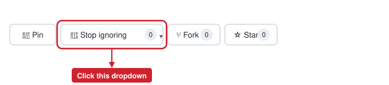
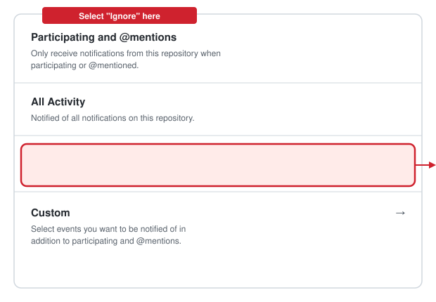

# Managing GitHub Notifications for This Repository

If you're watching the `Triangle-Loan-Database` repository on GitHub, you'll get an
email/web notification every time someone pushes a commit, opens a pull request, or
comments — which adds up fast on a repo that gets frequent automated commits (like the
ones from Claude Code). If you don't need that noise, you can turn notifications off for
just this repo without affecting your notification settings anywhere else on GitHub.

## Step 1 — Open the repository on GitHub

Go to `https://github.com/TriangleCRE/Triangle-Loan-Database` while signed in. In the
top-right area of the page, next to **Pin** and **Fork**, you'll see the notifications
button. Depending on your current setting it may read **Watch**, **Unwatch**, or (as
below) **Stop ignoring** — click it to open the dropdown.

## Step 2 — Turn off notifications for this repo

In the dropdown that opens, select **Ignore**. This means you'll never be notified about
activity on this repository again — no emails, no items in your GitHub notifications
inbox — regardless of what happens in it.

A checkmark next to **Ignore** confirms it's selected. You can come back to this same
dropdown any time to switch to a lighter-touch option instead:

- **Participating and @mentions** — only notify you when you're directly involved or
  @mentioned (a good middle ground if you want *some* signal, just not everything).
- **All Activity** — the default level of noise; notified of everything.
- **Custom** — pick specific event types (issues, pull requests, releases, etc.).

> This setting is per-repository — ignoring `Triangle-Loan-Database` won't change how
> notifications work on any other repo you have access to.
